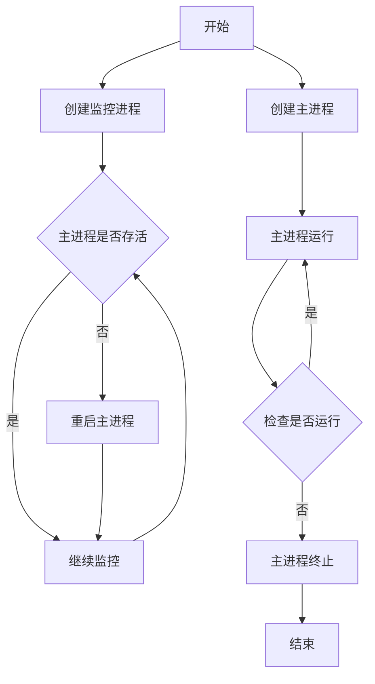

# BronzeMan

Automate the execution of multiple scripts.

### 项目名称：BronzeMan

### 1. 项目介绍

BronzeMan是一个自动化脚本执行工具，灵感来源于古希腊神话中的青铜人，能够自动执行预定义的任务。该工具读取JSON格式的任务定义文件，解析其中的任务数据结构，然后根据这些数据生成Shell或Python脚本，并自动执行它们。

### 2. 技术架构

- **语言和框架**：

  - Python：用于编写主要的应用逻辑。
  - Shell：用于编写可以直接在命令行中执行的脚本。
- **数据结构**：

  - JSON文件：用于定义任务的数据结构，包括任务名称、类型、执行参数等。
- **执行流程**：

  1. 读取JSON文件：解析包含任务定义的JSON文件。
  2. 数据解析：从JSON文件中提取必要的任务信息。
  3. 脚本生成：根据提取的任务信息生成Shell或Python脚本。
  4. 脚本执行：自动执行生成的脚本，或执行预先定义的Shell脚本。

### 3. 使用说明

- **安装**：

  - 确保Python环境已经安装。
  - 将BronzeMan项目克隆到本地机器。
- **配置任务**：

  - 编辑JSON文件，定义所需执行的任务。
  - JSON文件结构应包括任务的关键信息，如类型、参数等。
- **执行**：

  - 运行BronzeMan主程序。
  - 程序会自动读取JSON文件，生成并执行脚本。

### 4. 示例

- **任务定义示例**（JSON文件）:

  ```json
  {
      "name": "BronzeMan",
      "author": "liupengzhouyi",
      "version": "1.0",
      "category": "BronzeMan",
      "url": "https://github.com/liupengzhouyi/BronzeMan.git",
      "branch": "main",
      "code_path": "/Users/pengliu/Code",
      "engine": "shell"
  }
  ```
- **执行**：

  - 运行BronzeMan，它将自动执行上述定义的任务。

### 5. 扩展性和定制化

- 支持增加更多脚本类型，如Perl、Ruby等。
- 可以根据需要定制JSON文件的结构。
- 提供API接口，方便与其他系统集成。

### 6. 项目维护和支持

- 提供文档和示例，便于用户理解和使用。
- 定期更新和维护，修复已知问题。
- 开放社区讨论，鼓励用户贡献代码和想法。

## 稳定部署



```mermaid


```
